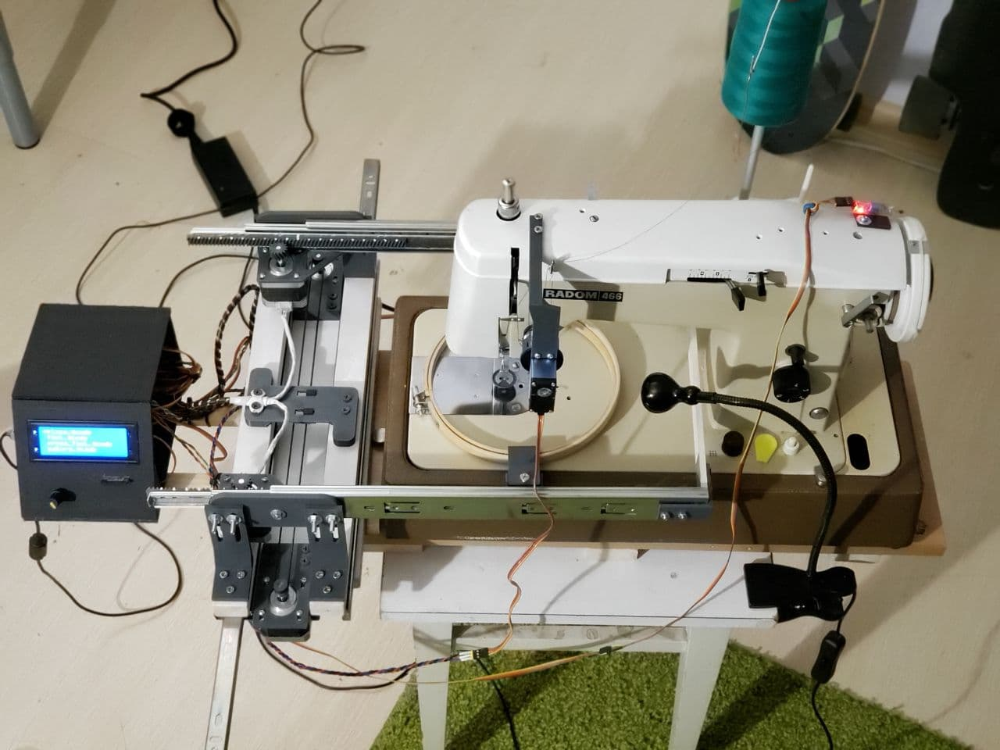
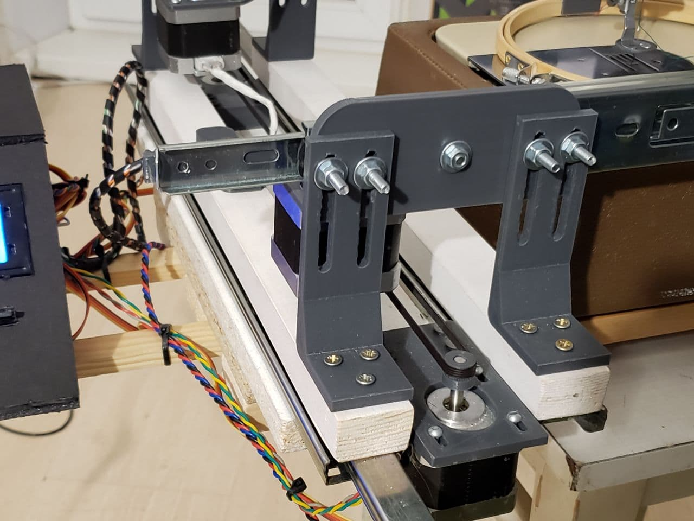
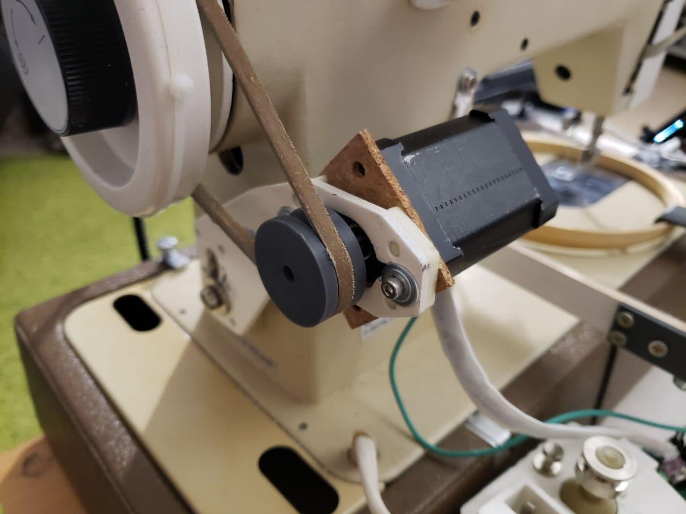
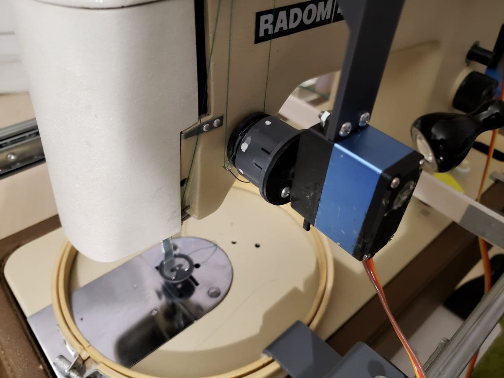
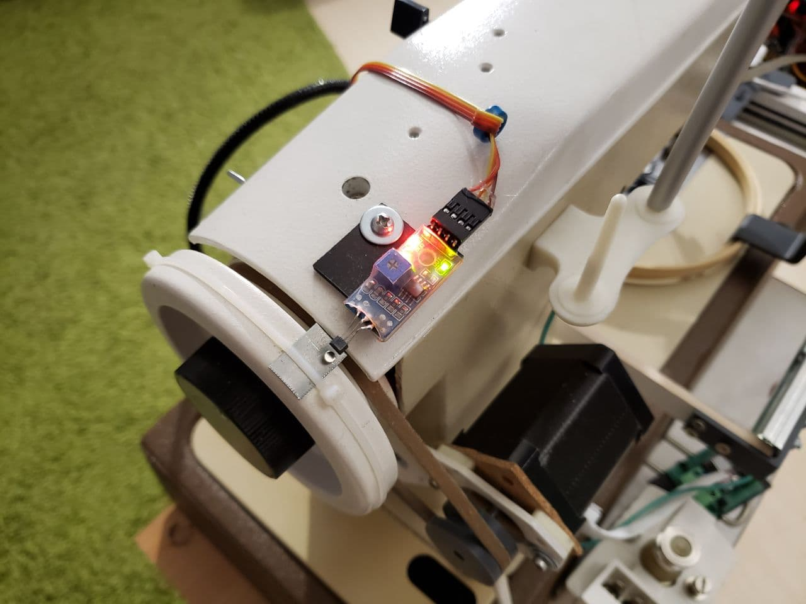
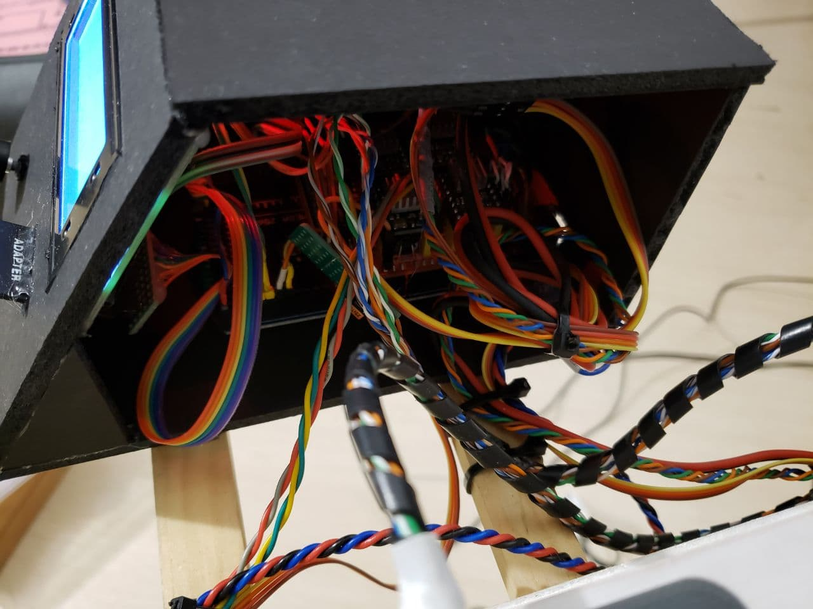
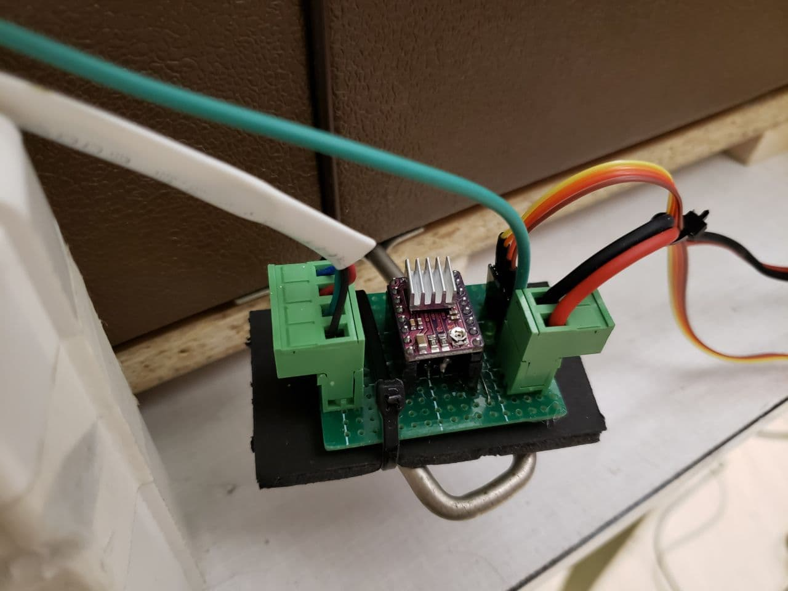
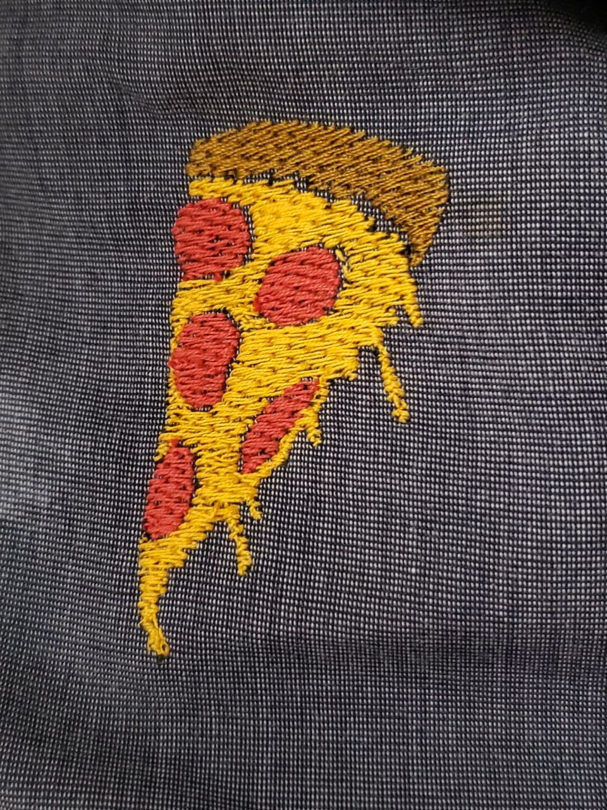
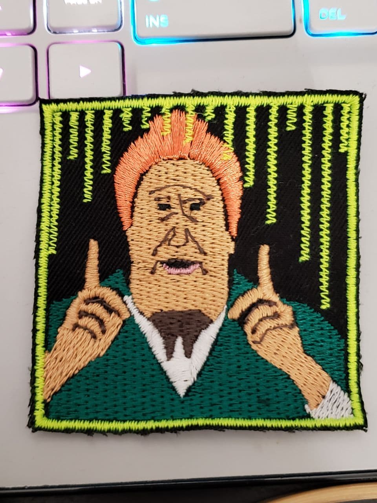
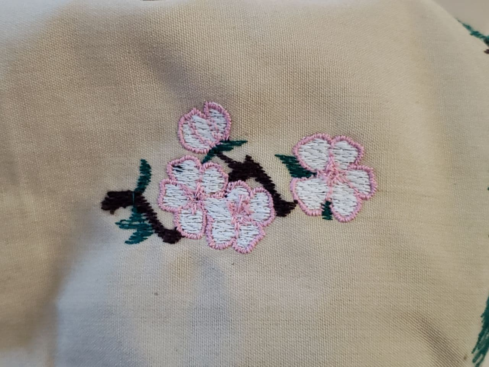

<h1 align="center">OpenEmbroidery</h1>

    

        
    

    

        
        
        
        
        
    

----------

## What is it?

Open Embroidery is an open source project that allows you to turn an ordinary sewing machine into an embroidery machine

The fabric is fixed in the hoop, which moves with the help of stepper motors. For simplicity and versatility, embroidery patterns are pre-converted to G-Code using application written in Python.  
The whole process is controlled by Arduino Mega.  

----------

## Hardware

    

        
        
    

Hoop moves by standard NEMA 17 stepper motors (as in 3D printers). As drivers, you can use A4988 or DRV8825

    

        
        
    

In order to move the fabric (jump) - it is necessary to loosen the tension of the thread. This is done by a servo connected to the thread tensioner.

The fabric must be moved when the needle is in a certain position (same as in normal sewing). For synchronization, a hall sensor is used. When the magnet passes near the sensor, the main motor starts to decelerate and the tissue moves

    

        
        
    

G-Code files are read from the memory card. To control the entire system, one single rotary encoder with a button is used. To display information, a 20x4 display connected via the I2C bus is used.

----------

## Examples

    

        
        
    

    

        
    

This is just a small part of what this project can do...

----------

## How to build this

Instruction in progress...
